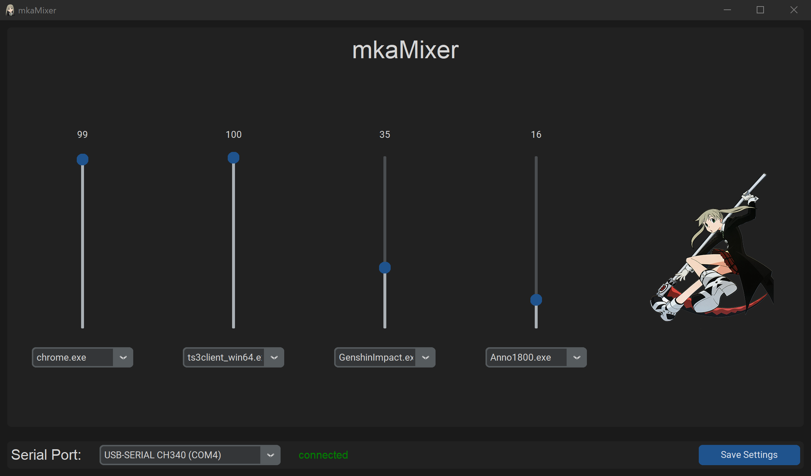
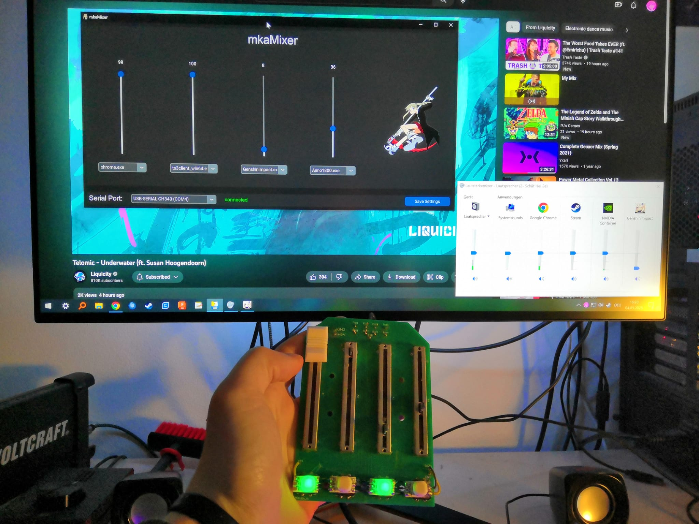

# mkaMixer

With this you can finally control your volume properly app by app!

## Screenshots

Here are some screenshots of my application in action:

### Application



### Device



## Installation

To install mkaMixer, follow these steps:

1. Download the mkaMixer.zip file
2. Unzip it wherever you like ( e.g. C:\Program Files (x86)\mkaMixer )
3. Go into the Folder and grab the mkaMixer.exe executable
4. Place a shortcut of the exe into your autostart folder ( Win + r , "shell:startup", Enter )
5. Download the mkaMixer.ino File from the Arduino Code Folder and upload it to your Arduino

## Dependencies
```shell
pip install customtkinter
```
```shell
pip install PySide6
```
```shell
pip install pywin32
```
```shell
pip install pyserial
```
```shell
pip install Pillow
```
